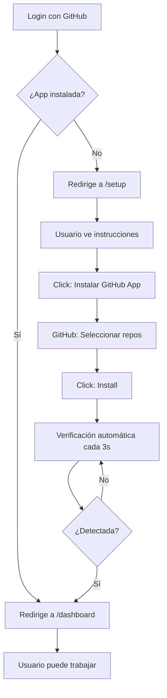

# ⚡ Quick Start - Instalación GitHub App

## 🎯 Para el Administrador (Una sola vez)

### 1. Asegúrate de tener el nombre correcto de tu GitHub App

En `.env`:
```bash
GITHUB_APP_NAME="broslunas-cms"  # Debe ser el slug, no el display name
```

**¿Dónde encontrar el slug?**
- Ve a: https://github.com/settings/apps
- Click en tu app
- El slug está en la URL: `github.com/settings/apps/[ESTE-ES-EL-SLUG]`

---

## 👤 Para Nuevos Usuarios

### Flujo Automático



### Vista del Usuario

1. **Primera vez (sin app)**
   ```
   Login → /setup
   
   Pantalla muestra:
   ┌─────────────────────────────────┐
   │  🐙 Bienvenido al CMS!          │
   │                                 │
   │  Para comenzar:                 │
   │  1. Instala la GitHub App       │
   │  2. Selecciona tus repos        │
   │  3. ¡Comienza a trabajar!       │
   │                                 │
   │  [Instalar GitHub App] →        │
   └─────────────────────────────────┘
   ```

2. **Durante instalación**
   ```
   • Pestaña se abre en GitHub
   • Usuario instala la app
   • Vuelve al CMS (pestaña original)
   • ✨ Redirige automáticamente a /dashboard
   ```

3. **Siguientes logins**
   ```
   Login → /dashboard (directo)
   
   Ya no ve /setup
   ```

---

## 🔧 Verificación Manual

### Probar el flujo

```bash
# 1. Iniciar el servidor dev
npm run dev

# 2. Abrir en navegador modo incógnito
# http://localhost:3000

# 3. Login con una cuenta GitHub que NO tenga la app

# 4. Deberías ver /setup automáticamente

# 5. Instalar la app desde /setup

# 6. Volver a la pestaña del CMS

# 7. En ~3 segundos → Redirige a /dashboard
```

---

## 📋 FAQ

### ¿Qué pasa si el usuario cierra la pestaña sin instalar?

Se queda en `/setup` y puede intentar de nuevo cuando quiera.

### ¿Cómo verifico que la app está instalada?

```bash
# En el backend
GET /api/check-installation

# Response:
{
  "installed": true,
  "message": "GitHub App instalada correctamente"
}
```

### ¿Puedo saltarme /setup?

No, el dashboard verifica `session.appInstalled` y redirige si es `false`.

### ¿Qué pasa si el usuario desinstala la app después?

El próximo login detectará `appInstalled: false` y lo enviará a `/setup` nuevamente.

### ¿Necesito configurar webhooks?

No, el polling cada 3 segundos es suficiente para una buena UX.

---

## 🎨 Personalización

### Cambiar el intervalo de verificación

En `components/InstallationChecker.tsx`:

```typescript
// Cambiar de 3000ms (3s) a otro valor
const interval = setInterval(async () => {
  // ...
}, 3000); // ← Cambiar aquí
```

### Personalizar el mensaje de setup

En `app/setup/page.tsx`, editar el contenido del `CardHeader` y `CardContent`.

---

## ✅ Checklist de Producción

Antes de llevar a producción:

- [ ] `GITHUB_APP_NAME` está correctamente configurado
- [ ] La GitHub App tiene permisos: **Contents: Read & Write**
- [ ] La GitHub App está publicada (no en borrador)
- [ ] `NEXTAUTH_URL` apunta a tu dominio de producción
- [ ] `NEXTAUTH_SECRET` es diferente al de desarrollo
- [ ] Probaste el flujo completo en staging

---

## 🚀 Deploy

Las variables de entorno necesarias en producción:

```bash
# MongoDB
MONGODB_URI=tu-mongodb-uri

# NextAuth
NEXTAUTH_URL=https://tu-dominio.com
NEXTAUTH_SECRET=tu-secret-seguro

# GitHub App
GITHUB_ID=tu-client-id
GITHUB_SECRET=tu-client-secret
GITHUB_APP_NAME=tu-app-slug
```

---

**¡Listo!** El CMS ahora requiere explícitamente que los usuarios instalen la GitHub App antes de poder gestionar contenido. 🎉
